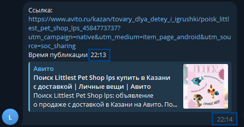
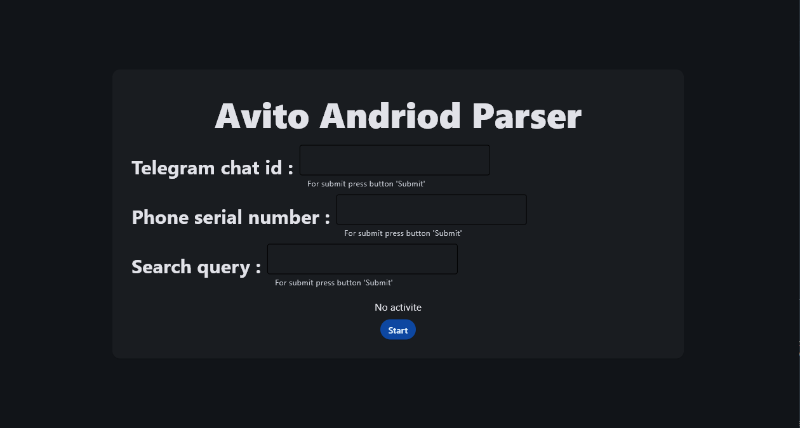

# Avito Android Parser

С помощью этого парсера вы можете получать новые объявления первыми, разница между публикацией и уведомлением: <b>1 минута</b>.

## Зависимости:
Бот работает при помощи ABD([Android Debug Bridge](https://developer.android.com/tools/adb?hl=ru)), для работы бота потребуется:
- Устройство на Win | Linux
    - [Драйвер ABD](https://adb.clockworkmod.com)
    - [Клиент парсера](https://github.com/kram1k/android_avito_parsing/blob/main/main.exe)
- USB 3.0
- Девайс Android >= 7.0
    - Отладка по USB
    - Авито >= 193.5
    - [Simple url viewer](https://github.com/kram1k/simple_url_viewer)

## Поддержка девайсов

|        | PC OC  | Android OC  | Model Android |
| ------ | ------ | ----------- | ------------- |
| stable | Win 10 | MIUI 11.0.2 | Redmi Note 4  |

## UI

